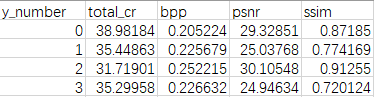

This is a script for researchers working in the field of image compression sensing.

In general, the algorithms we study need to be compared with the standard algorithm JPEG2000 for image compression. The most commonly used JPEG2000 software library is kakadu, which uses the command line to operate, and can only reconstruct one image at a time, not batch processing. This is very troublesome.

For the compression algorithm designed by the researcher, each image will get a compressed representation. To compare with JPEG2000, entropy coding is needed to obtain the total compression multiple, and then reconstruction is performed with kakadu, and finally PSNR and other indicators are calculated.

The script automatically calculates the entropy coding multiple of the compression representation y in the folder, multiplies the measurement rate to obtain the total compression multiple, converts to the pixel depth bpp, automatically calls kakadu, reconstructs the corresponding original image in the folder, and obtains PSNR and SSIM values for all results.

The total compression ratio is calculated as follows:
}}=\\sum_{i:r(i,j)=1}{\\big((\\theta^{(j)})^Tx^{(i)}-y^{(i,j)}\\big)x_k^{(i)}}+\\lambda \\xtheta_k^{(j)})

$$
total\;cr = cr *\frac{8}{Bit}*entropy\;cr
$$

toatal cr is the  total compression ratio.

cr is the compressed sensing measurement rate.

Bit:quantization bit.

entropy cr:entropy coding compression ratio,here, arithmetic coding or Huffman coding is generally used.

But in this script, the entropy coding compression ratio is calculated directly by the entropy of the compression representation.
$$
total\;cr = cr * \frac{8}{entropy\;of\; compression representation}
$$
The usage is as follows:

python batch_kakadu.py --y_path ‘measurements’ --orig_path ‘orig’ --represent_path ‘represent’ --recon_path ‘recon’ --cr 20 --coe 24 --image_format ‘bmp’

 y_path:the folder where the compressed representations of your own algorithm are placed 

orig_path: the folder where the original images are placed 

represent_path:the folder where the compressed representations of kakadu will be placed(If there is no such folder, it will be created automatically)

recon_path: the folder where the reconstructed images of kakadu will be placed(If there is no such folder, it will be created automatically)

cr:compressed sensing measurement rate

coe:If the image is a single-channel grayscale image, take 8; if the image is an RGB three-channel image, take 24.

 image_ format: The format of the image

 Note: 1.The original images must be named orig_0.~orig_n. Thecompressed representations must be named y_0.~y_n., and they must be one-to-one. The result is JPEG2000_result.csv 

2.For the use of kakadu, please refer to my CSDN blog:

https://blog.csdn.net/weixin_41786536/article/details/98526641

3.Please go to kakadu official website to download kakadu software:https://kakadusoftware.com/, select the kakadu version of Ubuntu16.04, put all the files here in the same path of kakadu.

4.This script directly uses entropy to calculate the entropy coding multiple of the compressed representation. This is the most ideal case. In practice, arithmetic coding or Huffman coding is generally used to calculate the entropy coding multiple, so the final result has a certain deviation from the actual situation.

5.If you want to batch process the reconstruction of your own algorithm, please refer to my other repository: https://github.com/liujiawei2333/PSNR-SSIM-batch-image
